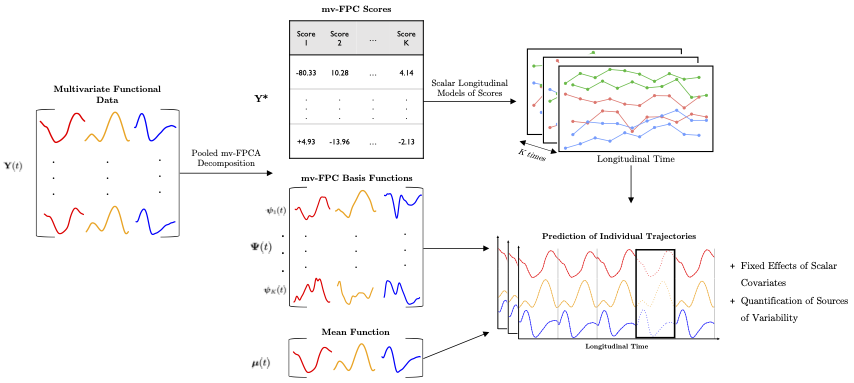

```{r setup, include=FALSE}
knitr::opts_chunk$set(echo = TRUE)
```

# Overview

[Slides](JHU_Talk.pdf) and Materials for Talk at JHU Wearable and Implantable Technology (WIT) research group.

**Talk title**: *"Functional Regression Models in Human Movement Biomechanics: Methodology and Applications"*



# Supporting Literature

* Gunning, E., Golovkine, S., Simpkin, A. J., Burke, A., Dillon, S., Gore, S., ... & Bargary, N. (2024). Analysing kinematic data from recreational runners using functional data analysis. arXiv preprint [arXiv:2408.08200](	https://doi.org/10.48550/arXiv.2408.08200).

* Gunning, E., Golovkine, S., Simpkin, A. J., Burke, A., Dillon, S., Gore, S., ... & Bargary, N. (2024). A Multivariate Multilevel Longitudinal Functional Model for Repeatedly Observed Human Movement Data. arXiv preprint [arXiv:2408.08481]( 	https://doi.org/10.48550/arXiv.2408.08481).

# Contact

* 📧 **Email**: [Edward.Gunning@pennmedicine.upenn.edu](mailto:Edward.Gunning@pennmedicine.upenn.edu).

* 🌐 **Website**: [edward.gunning.github.io](https://edward.gunning.github.io).

